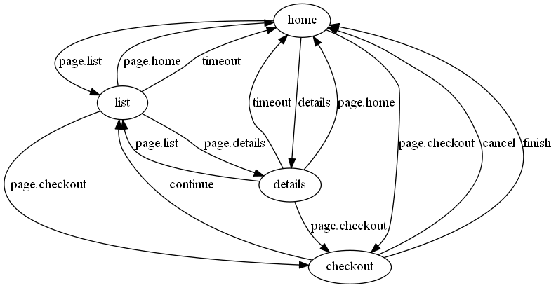
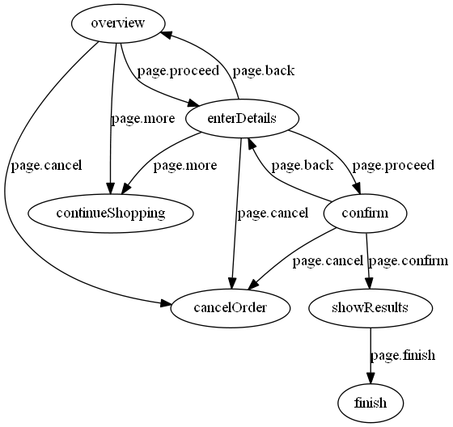

# Introduction
A stateflow is a collection of steps which has to be executed in a controlled order.
A step is defined as a state, a state has an action which is executed asynchronously.
The next state to go is defined as an "on" mapping either by mapping a state action completion event triggered by an execution callback or
by an event emitted from one of the registered objects.

A step/state is also a resting point, waiting for the next event/decision before going to the next state.

A flow can also be used as an action in an other flow, in this case it's a subflow where the flow end event is mapped to state completion event.

## Intention
The intention of stateflow is provide a means to implement high level processes, using a flow/state machine as a programming language often tends more complex graph than the original implementation.

## Example of shopping cart flow and checkout subflow from [stateflow-example](https://github.com/philipdev/stateflow-example)
### shopping card

### checkout subflow


## Use cases
* Guided user interfaces
* Build and deploy systems
* Device handling
* Implementation of workflow processes


# Usage

```
var stateflow = require('stateflow');
// Create a flow with flow definition (see jsdoc)
var flow = new stateflow.StateFlow({
	'entry-state' : {
		type:'begin',
		action: function(complete) {
			this.someData = 'myData'; // <-- every state has an State object assigned to action this
			complete('ignoredEvent');
			complete('myEvent'); // the state is over
		},
		on: {
			'myEvent':'other-state'
		}
	},
	'other-state': {
		action: function(complete) { // can also be a flow definition (subflow).
			this.get('myServiceOrData'); // <-- private field or inherented from parent flow
			this.listenTo('myServiceOrData','event', 'signalEvent'); // <-- event listener, cancelled on exit
			this.installTimeout(5000, 'timeout'); // <!-- state timeout, cancelled on state exit
		},
		on: {
			'timeout':'exit-state',
			'signalEvent':'named-action-state'
		}
	},
	'named-action-state': {
		action:'myAction', //<-- register with registerAction(name, action), useful for json definition or generic action's
		on: {
			'done':'exit-state',
			'loop':'named-action-state'
		}
	},
	'exit-state' : {
		type: 'end',
		action: function(complete) {
			complete('exitEvent');
		}
	}
});
flow.set('myServiceOrData', emitter);
flow.registerAction('myAction', function(complete) { // register action can also be flow definition (subflow)
	complete('done');
});
flow.start( function completionCallback(event) {
	console.log('State finished');
});
```

# Index

**Modules**

* [stateflow](# module_stateflow)
  * [callback: stateflow~action](# module_stateflow..action)
  * [callback: stateflow~completion](# module_stateflow..completion)
  * [class: stateflow~State](# module_stateflow..State)
    * [new stateflow~State(config, name, parent)](# new_module_stateflow..State)
    * [state.get(name)](# module_stateflow..State# get)
    * [state.set(name, obj)](# module_stateflow..State# set)
    * [state.onStateActive(objectOrName, event, listener)](# module_stateflow..State# onStateActive)
    * [state.onFlowActive(objectOrName, event, listener)](# module_stateflow..State# onFlowActive)
    * [state.cancelTimeout()](# module_stateflow..State# cancelTimeout)
    * [state.installTimeout(timeout, handler)](# module_stateflow..State# installTimeout)
  * [class: stateflow~StateFlow](# module_stateflow..StateFlow)
    * [new stateflow~StateFlow(config)](# new_module_stateflow..StateFlow)
    * [stateFlow.start(complete)](# module_stateflow..StateFlow# start)
    * [stateFlow.getStateObject(state)](# module_stateflow..StateFlow# getStateObject)

**Typedefs**

* [type: stateDefinition](# stateDefinition)
* [type: flowDefinition](# flowDefinition)
 
<a name="module_stateflow"></a>
# stateflow
**Members**

* [stateflow](# module_stateflow)
  * [callback: stateflow~action](# module_stateflow..action)
  * [callback: stateflow~completion](# module_stateflow..completion)
  * [class: stateflow~State](# module_stateflow..State)
    * [new stateflow~State(config, name, parent)](# new_module_stateflow..State)
    * [state.get(name)](# module_stateflow..State# get)
    * [state.set(name, obj)](# module_stateflow..State# set)
    * [state.onStateActive(objectOrName, event, listener)](# module_stateflow..State# onStateActive)
    * [state.onFlowActive(objectOrName, event, listener)](# module_stateflow..State# onFlowActive)
    * [state.cancelTimeout()](# module_stateflow..State# cancelTimeout)
    * [state.installTimeout(timeout, handler)](# module_stateflow..State# installTimeout)
  * [class: stateflow~StateFlow](# module_stateflow..StateFlow)
    * [new stateflow~StateFlow(config)](# new_module_stateflow..StateFlow)
    * [stateFlow.start(complete)](# module_stateflow..StateFlow# start)
    * [stateFlow.getStateObject(state)](# module_stateflow..StateFlow# getStateObject)

<a name="module_stateflow..action"></a>
## callback: stateflow~action
State activation action, can be defined as function, by name (string) or by subflow definition (object).<br/>
If it was defined by name in the state definition then the must be been registered previously with registerAction().<br/>
If defined by flow definition then start and end of the flow will be mapped to the state.

**Params**

- completion `completion` - state completion callback  

**Scope**: inner typedef of [stateflow](# module_stateflow)  
**Type**: `function`  
<a name="module_stateflow..completion"></a>
## callback: stateflow~completion
State completion callback  available as first argument of `action` or as stateComplete property of `State`.

**Params**

- event `string` - completion event  

**Scope**: inner typedef of [stateflow](# module_stateflow)  
**Type**: `function`  
<a name="module_stateflow..State"></a>
## class: stateflow~State
**Members**

* [class: stateflow~State](# module_stateflow..State)
  * [new stateflow~State(config, name, parent)](# new_module_stateflow..State)
  * [state.get(name)](# module_stateflow..State# get)
  * [state.set(name, obj)](# module_stateflow..State# set)
  * [state.onStateActive(objectOrName, event, listener)](# module_stateflow..State# onStateActive)
  * [state.onFlowActive(objectOrName, event, listener)](# module_stateflow..State# onFlowActive)
  * [state.cancelTimeout()](# module_stateflow..State# cancelTimeout)
  * [state.installTimeout(timeout, handler)](# module_stateflow..State# installTimeout)

<a name="new_module_stateflow..State"></a>
### new stateflow~State(config, name, parent)
Instance assigned to each state in a flow and bound to the action's this variable.

**Params**

- config `object` - subflow definition which might contain additional properties.  
- name `string` - state name.  
- parent `StateFlow` - flow.  

**Properties**

- active `boolean` - is true when the state is the current state (initial false offcourse).  
- parent `StateFlow` | `undefined` - only set on subflows and regular states.  
- config <code>[stateDefinition](# stateDefinition)</code> - state defintion  

**Scope**: inner class of [stateflow](# module_stateflow)  
<a name="module_stateflow..State# get"></a>
### state.get(name)
Get an object value from the current state or it's parents.

**Params**

- name `string` - the object name  

<a name="module_stateflow..State# set"></a>
### state.set(name, obj)
Set a property

**Params**

- name `string`  
- obj `object` | `function` - object or getter function executed on `State# get`  

<a name="module_stateflow..State# onStateActive"></a>
### state.onStateActive(objectOrName, event, listener)
Listen to an event while the state is active

All events registered with 'onStateActive' are automatically removed when the state exits.

**Params**

- objectOrName `object` | `string` - the service name (string) which was registered with set or event emitter instance (object),  
- event `string` - the event to listen on  
- listener `callback` | `string` - event listener function or state completion event  

<a name="module_stateflow..State# onFlowActive"></a>
### state.onFlowActive(objectOrName, event, listener)
Listen for flow events while the flow is running an objectOrName, event, the listener will be registered only once.
for the same set of arguments per state, even when called multiple times which is the typical use case.

**Params**

- objectOrName   
- event   
- listener   

<a name="module_stateflow..State# cancelTimeout"></a>
### state.cancelTimeout()
Cancel the previous installed timeout, always executed when state exits.
Can be used within a state action.

<a name="module_stateflow..State# installTimeout"></a>
### state.installTimeout(timeout, handler)
Install a state timeout handler, an active timeout is automatically cancelled before going to the next state.
If handler is omitted then the last handler after cancelTimeout() will be reset also the last timeout time will be reset if omitted and available.

**Params**

- timeout `integer` - timeout in milliseconds  
- handler `callback` | `string` - function or completion event (string).  

<a name="module_stateflow..StateFlow"></a>
## class: stateflow~StateFlow
**Extends**: `State`  
**Members**

* [class: stateflow~StateFlow](# module_stateflow..StateFlow)
  * [new stateflow~StateFlow(config)](# new_module_stateflow..StateFlow)
  * [stateFlow.start(complete)](# module_stateflow..StateFlow# start)
  * [stateFlow.getStateObject(state)](# module_stateflow..StateFlow# getStateObject)

<a name="new_module_stateflow..StateFlow"></a>
### new stateflow~StateFlow(config)
StateFlow is an async event state machine, using js object notation.<br/>
Each property is a state the value is the state definition, state definition has:<br/>
 action: function, register action, or subflow definition.<br/>
 on: a mapping between state completion events and target state<br/>
 type: 'begin': the initial state of the flow, 'end': the state that terminates the flow after execution the action.

<pre>
Usage:
var flow = new StateFlow({
     beginState: {
         type: 'begin',
         action: function (complete) {
             complete('anEvent');
         },
         on: {
             anEvent:'nextState'
         }
     },
     nextState: {
         type: 'end',
         action: function (complete) {
             complete('done'); 
         } 
     }
});
flow.start(function (event) {
    if(event !== 'done') throw new Error('event must be done, as in nextState');
});
</pre>

**Params**

- config <code>[flowDefinition](# flowDefinition)</code> - flow definition  

**Properties**

- currentState `string`  
- parent `StateFlow`  

**Extends**: `State`  
**Scope**: inner class of [stateflow](# module_stateflow)  
<a name="module_stateflow..StateFlow# start"></a>
### stateFlow.start(complete)
Start the flow with the state of type 'begin'

**Params**

- complete `completion` - callback to be called when the end state has been reached.  

<a name="module_stateflow..StateFlow# getStateObject"></a>
### stateFlow.getStateObject(state)
Get the state instance object, which is associated with the state action this.
Used to provide functionallity and data state see {State}.

For every state there is state object.

**Params**

- state `string` - state name to get an state object for  

**Returns**: `State` - state instance object  
<a name="stateDefinition"></a>
# type: stateDefinition
**Properties**

- type `string` - 'begin': initial state on flow start, 'state': normal state (default), 'end': flow terminates when this state  
- action `action` - executed when the state becomes active, defined a function, action name to use a registered action or subflow object flow defintion.  
- initialize `function` - is called when the flow starts.  
- destroy `function` - is called when the flow exits.  
- on `object` - key is state completion event value is the next state to goto. 'objectName.eventName' is also supported, aka if this.get('objectName') emits eventName then goto the next state .  

<a name="flowDefinition"></a>
# type: flowDefinition
**Properties**

- *stateName* <code>[stateDefinition](# stateDefinition)</code> - every state has a state name and a state definition.  

**Type**: `object`  
